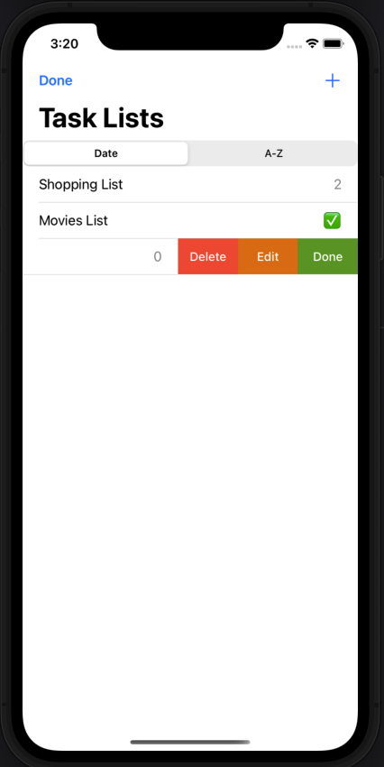
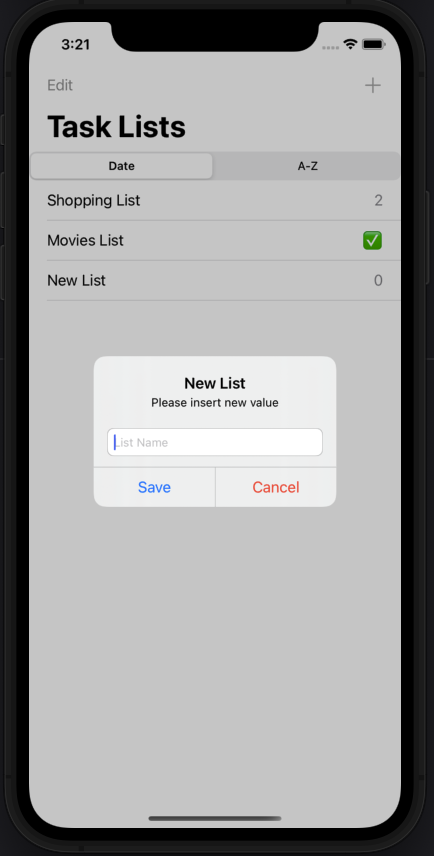
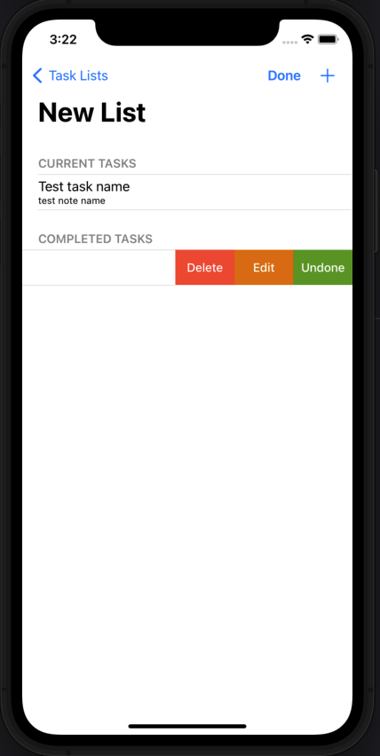
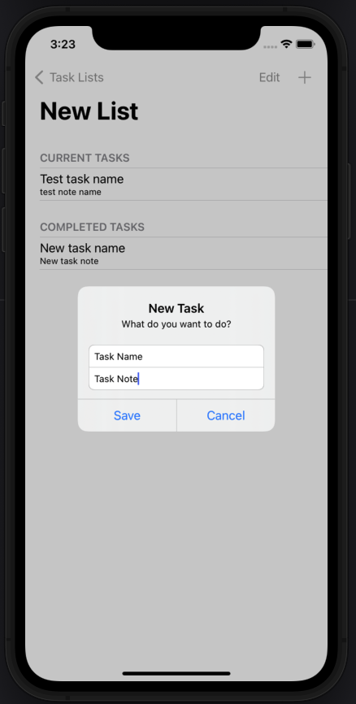

# TaskListRealm
___

## Описание 

Минималистичный список ваших задач. Приложение состоит из 2 экранов.

__1. Экран, на котором вы можете добавить список.__ 

+ На этом экране вы можете отфильтровать задачи по алфавиту или дате добавления.
+ Добавление списка происходит с помощью всплывающего окна.
+ При помощи свайпа влево в таблице реализован список дополнительных действий, которые вы можете выполнить.
    + Удалить список.
    + Изменить имя.
    + Обозначить, что все задачи внутри списка выполнены.

 

__2. Экран, на котором находятся задачи внутри списка.__ 

+ Добавление задач происходит аналогично, отличие заключается, что можно добавить небольшую заметку.
+ У задач можно менять статус с текущих на выполненные и обратно.
+ Если все задачи в списке находятся в статусе выполненные, список на главном экране будет иметь индикатор ✅.

 

____

## Используемые технологии

+ Язык    
+ Версия языка 5.5
+ Интерфейс приложение создан при помощи __Interface Builder__
+ Архитектура      c сервисным слоем для хранения данных.
+ Сохранение данных происходит при помощи   
+ __UserDefaults__
+ __UITableViewController__
+ __UIAlertController__

> Для того чтобы запустить проект и посмотреть функциональность, необходимо открыть в терминале директорию с проектом и при помощи команды
> ``` pod install ``` установить фреймворк Realm.

___

### Некоторые особенности

При запуске проекта уже внесены некоторые данные, которые добавлены при помощи __UserDefaults__ в классе __DataManager__.

```swift
class DataManager {
    
    static let shared = DataManager()
    
    private init() {}
    
    func createTempData(_ completion: @escaping() -> Void) {
        if !UserDefaults.standard.bool(forKey: "done") {
            UserDefaults.standard.set(true, forKey: "done")
            
            let shoppingList = TaskList()
            shoppingList.name = "Shopping List"
            
            let moviesList = TaskList(value: ["Movies List", Date(), [
                ["Best Film Ever"],
                ["The Best Of The Best", "Must Have", Date(), true]
            ]])
            
            let milk = Task()
            milk.name = "Milk"
            milk.note = "2L"
            
            let bread = Task(value: ["Bread", "", Date(), true])
            let apples = Task(value: ["name": "Apple", "note": "2Kg"])
            
            shoppingList.tasks.append(milk)
            shoppingList.tasks.insert(contentsOf: [bread, apples], at: 1)
            
            DispatchQueue.main.async {
                StorageManager.shared.save([shoppingList, moviesList])
                completion()
            }
        }
    }
}
```


